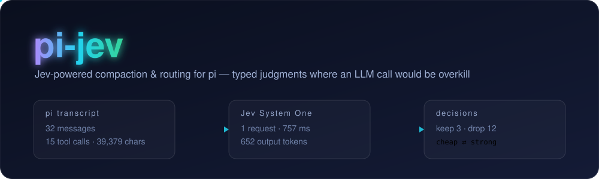

<div align="center">

# pi-jev

**由 [Jev](https://typesafe.ai) 驱动，为 [pi](https://github.com/earendil-works/pi-coding-agent) 提供选择性上下文压缩和逐轮模型路由。**

[English](README.md) · **简体中文**



[](https://github.com/iefnaf/pi-jev/actions/workflows/test.yml)
[](https://github.com/earendil-works/pi-coding-agent)
[](https://typesafe.ai)
[](LICENSE)

</div>

pi-jev 使用 Jev 的类型化判断，识别仍有价值的工具输出，并评估用户请求的难度。压缩时保留有用的原文，而不是生成新的摘要；每轮开始前，还可以根据难度切换模型。两项功能均可选：Jev 不可用时，pi 会使用原生压缩或继续使用当前模型。

| 扩展 | 功能 | Pi 接入点 |
| --- | --- | --- |
| **上下文压缩** | 移除过时的工具调用，缩短不再需要的结果，其余文本保留原文 | `session_before_compact` |
| **模型路由** | 简单请求交给低成本模型，复杂请求交给能力更强的模型 | `before_agent_start` |
| **`/jev` 设置** | 通过交互菜单配置服务提供方、压缩和路由 | `/jev` 命令 |

每个扩展都可通过 `pi config` 独立启停。配置会在下次钩子触发时读取，无需重启 pi。

## 快速开始

需要已安装 pi，并拥有 **TypeSafe 或 OpenRouter 中任意一个** Jev 接入服务的 API Key。路由目标模型还需要在 pi 中完成配置和认证。

### 1. 配置 Jev API Key

在启动 pi 的终端中，选择一种方式：

```sh
# 方式 A：TypeSafe
export TYPESAFE_API_KEY="your-typesafe-api-key"
```

```sh
# 方式 B：OpenRouter
export OPENROUTER_API_KEY="your-openrouter-api-key"
```

未显式配置服务提供方时，项目会根据 API Key 自动选择。如果两个 Key 都存在，优先使用 TypeSafe；设置 `JEVC_PROVIDER=openrouter` 可显式选择 OpenRouter。

### 2. 安装并启动

```sh
pi install https://github.com/iefnaf/pi-jev
pi config   # 检查已启用的 pi-jev 扩展
pi
```

如果在 pi 会话运行期间安装，使用 `/reload` 加载扩展。

### 3. 在 pi 中配置

```text
/jev
```

进入 **Routing**，从 pi 的模型列表选择 `cheap` 和／或 `strong` 目标，还可选择思考等级。**至少设置一个目标后，模型路由才会启用。** 上下文压缩不需要配置路由目标；可以通过 `/compact` 手动触发，也会随 pi 的自动压缩运行。

| 操作 | 命令或方式 |
| --- | --- |
| 打开设置 | `/jev` |
| 压缩当前会话 | `/compact` |
| 查看可用设置项 | `/jev keys` |
| 查看路由目标 | `/jev get routing.cheap` |
| 移除路由目标 | `/jev unset routing.strong` |
| 暂时跳过两项功能 | `/jev set disabled true` |
| 重新启用两项功能 | `/jev set disabled false` |
| 写入项目配置 | 添加 `-l`，例如 `/jev set provider openrouter -l` |

配置**默认写入全局文件**，`disabled` 也不例外；使用 `-l` 可限定到项目。若只想对一次 pi 进程跳过两项功能，使用 `JEVC_DISABLED=1 pi` 启动。

<details>
<summary>从本地源码安装，或单独加载一个扩展</summary>

```sh
git clone https://github.com/iefnaf/pi-jev.git
cd pi-jev
npm ci
npm run build
pi install /absolute/path/to/pi-jev
```

在仓库根目录进行开发时，可使用：

```sh
pi -e ./extensions/compaction.ts
pi -e ./extensions/routing.ts
pi -e ./extensions/jev.ts
```

每条命令显式加载一个扩展。信任此仓库后，项目的 `.pi/extensions/jev-*` 加载器也会被自动发现。

</details>

## 上下文压缩

pi-jev 不让摘要模型改写整个对话，而是针对每个可评估的工具调用，向 Jev 提出类型化问题：是否保留调用、是否保留完整结果（`noul`），以及结果有多过时（`score`）。随后将保留内容渲染为对话记录。

- **保留：** 保留用户和助手文本、受保护的近期消息，以及有用的工具调用和结果。上一轮压缩摘要原样嵌入。
- **移除：** 过时的工具调用及其结果一起删除，记录头部会说明移除数量。
- **缩短：** 保留工具调用，将较长的结果缩短至前 `truncateHeadChars` 个字符，并添加明确的截断标记。较短的结果可能保持不变。
- **补救：** 如果结果的保留概率接近阈值，且过时程度判断以足够置信度表明它仍有用，则完整保留。
- **回退：** Jev 出错、请求中止、待压缩片段为空，或估算缩减比例低于 `minReduction` 时，交给 pi 生成原生摘要。单个调用的回答缺失或格式异常时，保守地保留该调用。

请求会根据上下文和请求预算分批，因此一次压缩可能发出多个 Jev 请求。近期消息保护作用于 pi 提供的待压缩片段中经过转换的消息。

**“保留原文”针对保留的文本，并非原始消息的所有字段：** 转换时图片替换为 `[image]` 占位符，助手的思考块会被省略；工具输入会序列化到记录中。

### 结果示例

本项目记录的一次示例运行，将转换后的片段从 **32 条消息／39,379 个字符** 缩减至 **16 条消息／9,553 个字符**，耗时 **757 ms**，使用一次 Jev 请求和 652 个输出 token。这只是示例，并非延迟或压缩比例保证。

成功的压缩会将审计数据写入会话的 `compaction` 条目：

```json
{
  "engine": "jev",
  "stats": {
    "messagesBefore": 32,
    "messagesAfter": 16,
    "charsBefore": 39379,
    "charsAfter": 9553,
    "calls": 15,
    "pinned": 3,
    "callsDropped": 12,
    "ms": 757,
    "requests": 1,
    "jevUsage": { "input": 9784, "output": 652 }
  }
}
```

以上是条目中 `details` 对象的精简示例。查看 `details.engine`、`details.stats` 和 `details.decisions` 可了解完整结果。钩子保留 `firstKeptEntryId`，供 pi 正确保留会话的剩余部分。

## 模型路由

每轮开始前，Jev 根据**当前用户提示**，按三个等级评估难度：

| 等级 | 典型请求 |
| --- | --- |
| `0` — 简单 | 问候、简短问题、格式调整、机械性的单文件修改 |
| `1` — 中等 | 日常编码任务 |
| `2` — 复杂 | 多文件重构、隐蔽问题调试、架构决策 |

使用默认阈值时：

| 条件 | 动作 |
| --- | --- |
| 难度 ≤ `0.5`、置信度 ≥ `0.6`，且设置了 `routing.cheap` | 切换到低成本模型 |
| 难度 ≥ `1.5`、置信度 ≥ `0.6`，且设置了 `routing.strong` | 切换到强模型 |
| 中间难度、低置信度、回答缺失，或对应目标未设置 | 保持当前模型 |

**中间难度的请求会沿用当前模型，包括上一轮路由选择的模型。** 它不会自动切回初始默认模型。路由评估使用当前提示，而非完整对话历史。

模型引用格式错误、模型不存在、服务提供方未认证，或 Jev 请求失败时，保持当前模型。提示包含图片时，会跳过仅支持文本的 `cheap` 目标。目标与当前模型相同时不执行切换。成功切换和路由错误通过 pi 界面通知显示。

模型引用格式为 `provider/model-id`，可附加 `:thinking` 后缀，例如 `:high` 或 `:max`。建议通过 `/jev` 选择 pi 中实际配置的模型；思考等级在发生模型切换时应用。

## 配置

配置按以下顺序解析，优先级从高到低：

1. 环境变量
2. 项目配置：`.pi/jev.json`
3. 全局配置：`~/.pi/agent/jev.json`
4. 内置默认值

API Key **仅通过环境变量设置**，不会写入配置文件。钩子在每次事件中重新读取配置，改动对下一轮或下一次压缩生效。环境变量仍会覆盖通过 `/jev` 修改的文件配置。

### 交互菜单与命令

在交互模式的 pi 中，直接输入 `/jev` 打开设置菜单：

```text
pi-jev
├─ Toggle scope (global ⇄ project)  切换写入范围
├─ General        provider · model · baseUrl · disabled
├─ Compaction     压缩阈值和 token 预算
├─ Routing        cheap · strong → 模型 → 思考等级
└─ Show resolved config            查看最终生效配置
```

文本命令支持动作、配置键和模型引用的补全：

```text
/jev set provider openrouter -l
/jev get routing.cheap
/jev unset routing.strong
/jev keys
/jev path -l
```

### 配置文件示例

项目的 `.pi/jev.json` 可以设置接入服务和压缩策略：

```json
{
  "provider": "openrouter",
  "disabled": false,
  "compaction": {
    "keepThreshold": 0.5,
    "preserveRecentMessages": 3,
    "minReduction": 0.15
  }
}
```

通过 `/jev` → **Routing** 添加路由目标，或将 `routing.cheap`／`routing.strong` 设置为已配置的模型引用。设置任意一个目标即可独立启用路由。

### 终端 CLI

从已构建的本地仓库中，CLI 可管理同一组配置文件：

```sh
node bin/pi-jev.js config
node bin/pi-jev.js config set provider openrouter -l
node bin/pi-jev.js config get routing.cheap
node bin/pi-jev.js config unset routing.strong
node bin/pi-jev.js config keys
node bin/pi-jev.js config path -l
```

如果包的可执行文件已加入 `PATH`，可改用 `pi-jev config …`。`get` 读取最终生效值；`set`、`unset` 和 `path` 默认使用全局范围，添加 `-l`／`--project` 则使用项目范围。

### Jev 接入服务

以下是本项目代码中的默认值：

| 设置 | TypeSafe | OpenRouter |
| --- | --- | --- |
| 服务提供方 | `typesafe` | `openrouter` |
| 接口地址 | `https://api.typesafe.ai/v1/systemone` | `https://openrouter.ai/api/alpha/decisions`（alpha） |
| API Key | `TYPESAFE_API_KEY` | `OPENROUTER_API_KEY` |
| Jev 模型 | `jev-latest` | `typesafe/jev-1.13` |

两者使用相同的 `{ model, state, questions }` → `{ answers }` 协议。Jev 判断模型与作为路由目标的 pi 模型是分别配置的。

`JEVC_API_KEY` 会覆盖所选服务的专用 Key，但本身不会选择服务提供方；使用 OpenRouter Key 时，应同时设置 `JEVC_PROVIDER=openrouter`。

### 环境变量

通用设置：

| 变量 | 默认值 | 用途 |
| --- | --- | --- |
| `TYPESAFE_API_KEY` | 未设置 | TypeSafe 认证 |
| `OPENROUTER_API_KEY` | 未设置 | OpenRouter 认证 |
| `JEVC_API_KEY` | 未设置 | 覆盖所选服务的 API Key |
| `JEVC_PROVIDER` | 自动检测 | `typesafe` 或 `openrouter` |
| `JEVC_MODEL` | 随接入服务选择 | Jev 模型标识 |
| `JEVC_BASE_URL` | 随接入服务选择 | Jev 接口地址 |
| `JEVC_DISABLED` | `false` | `1`、`true` 或 `yes` 跳过两项功能的钩子 |

上下文压缩：

| 变量 | 配置键 | 默认值 |
| --- | --- | --- |
| `JEVC_KEEP_THRESHOLD` | `compaction.keepThreshold` | `0.5` |
| `JEVC_BORDERLINE` | `compaction.borderline` | `0.1` |
| `JEVC_PRESERVE_RECENT` | `compaction.preserveRecentMessages` | `3` |
| `JEVC_TRUNCATE_HEAD` | `compaction.truncateHeadChars` | `300` |
| `JEVC_MIN_REDUCTION` | `compaction.minReduction` | `0.15` |
| `JEVC_MAX_STATE_TOKENS` | `compaction.maxStateTokens` | `25000` |
| `JEVC_MAX_REQUEST_TOKENS` | `compaction.maxRequestTokens` | `30000` |

`keepThreshold` 控制原文保留阈值，`borderline` 定义阈值下方可由过时程度判断补救的区间。`preserveRecentMessages` 保护近期转换后的消息；`truncateHeadChars` 限制截断结果保留的头部字符数。`minReduction` 是替代 pi 原生摘要所需的最低估算缩减比例。两个 token 上限分别约束 Jev 上下文，以及上下文加问题的单次请求。

模型路由：

| 变量 | 默认值 | 用途 |
| --- | --- | --- |
| `JEVC_ROUTE_CHEAP` | 未设置 | 简单请求的目标模型引用 |
| `JEVC_ROUTE_STRONG` | 未设置 | 复杂请求的目标模型引用 |
| `JEVC_ROUTE_EASY_MAX` | `0.5` | 使用低成本模型的最高难度 |
| `JEVC_ROUTE_HARD_MIN` | `1.5` | 使用强模型的最低难度 |
| `JEVC_ROUTE_MIN_CONFIDENCE` | `0.6` | 切换模型所需的最低置信度 |

路由阈值属于配置加载器支持的高级覆盖项，不在设置菜单或 CLI 配置键列表中展示。

## 常见问题

| 现象 | 检查方式 |
| --- | --- |
| `/jev` 不可用 | 通过 `pi config` 启用 `extensions/jev.ts`，必要时执行 `/reload` |
| 压缩仍使用 pi 原生摘要 | 检查所选服务的 API Key、`disabled`、Jev 错误和 `minReduction` |
| 路由始终不切换模型 | 至少设置一个目标，确认 pi 模型已认证，并检查难度与置信度条件 |
| 修改配置后没有生效 | 检查环境变量和项目配置，它们的优先级高于全局配置 |
| 本地 CLI 找不到 `dist/cli/main.js` | 执行 `npm run build` |

## 开发

CI 使用 Node.js 22。在仓库根目录运行：

```sh
npm ci
npm run typecheck
npm test
npm run build
```

测试使用固定样例和模拟的 `JevAsker`，不会调用 Jev API。覆盖压缩决策和消息转换、路由、配置优先级、CLI、参数补全、模型选择及菜单界面。

| 路径 | 职责 |
| --- | --- |
| [src/compaction](src/compaction) | 消息转换、Jev 请求分批、保留规则、记录渲染和压缩钩子 |
| [src/routing](src/routing) | 难度决策与模型切换 |
| [src/commands](src/commands) | `/jev`、设置菜单、参数补全和模型选择 |
| [src/cli](src/cli) | 共用配置命令引擎 |
| [src/shared/config.ts](src/shared/config.ts) | 配置分层、默认值和配置键元数据 |
| [extensions](extensions) | 扩展入口 |
| [src/vendor/fast-jev-compaction](src/vendor/fast-jev-compaction) | 内置的第三方 Jev 客户端和压缩基础模块 |
| [test](test) | 离线测试套件 |

新增功能时，在 `src/<feature>/` 创建默认导出的扩展工厂及纯函数辅助模块，在 `extensions/` 添加薄入口，在 `src/shared/config.ts` 定义配置，并在 `test/` 覆盖行为。Jev 请求失败时必须允许 pi 继续运行。

## 致谢

- [tamaratran/fast-jev-compaction](https://github.com/tamaratran/fast-jev-compaction)：以 MIT 许可内置的 Jev 客户端和压缩基础模块，许可证随源码保留。
- [@narumitw/pi-tui-kit](https://www.npmjs.com/package/@narumitw/pi-tui-kit)：提供 `/jev` 交互设置菜单。
- [TypeSafe](https://typesafe.ai)：提供 Jev System One；OpenRouter 提供另一种 Decisions API 接入方式。

## 许可证

[MIT](LICENSE)。
